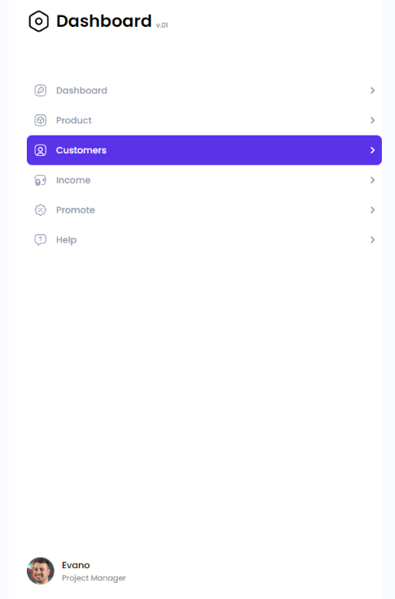
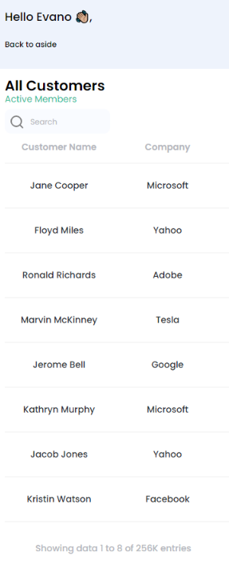

# Test task

**Description**

This test task includes layout: 

1. For a layout width of 1440px. 
2. For the mobile version from 360px to 640px.

The reference layout can be seen at this link: <a href="https://www.figma.com/file/3jPRRdGbHJbOT9P61KxT2y/CRM-Dashboard-Customers?type=design&node-id=501-2&mode=design&t=WWuq0W8v415qmzJb-0" target="_blank">this link</a>

There is no reference for the mobile version, styles are made at your discretion. 

The functionality of the mobile version works as shown in the screenshot below:




__________________________
**Instruction**

To run the project on your computer, clone the repository.

To install packages, use the command:

```bash
npm i
```

### Starting a server for development  


```bash
npm run start
```

### Building a project without optimization

```bash
npm run build-dev
```


### Build the project with optimization

```bash
npm run build-prod
```

### Cleaning the dist folder

```
npm run clear
```

Follow <a href="https://chehrynets-anzhelika.github.io/test-task/" target="_blank">this link</a> to see the project deployment.


